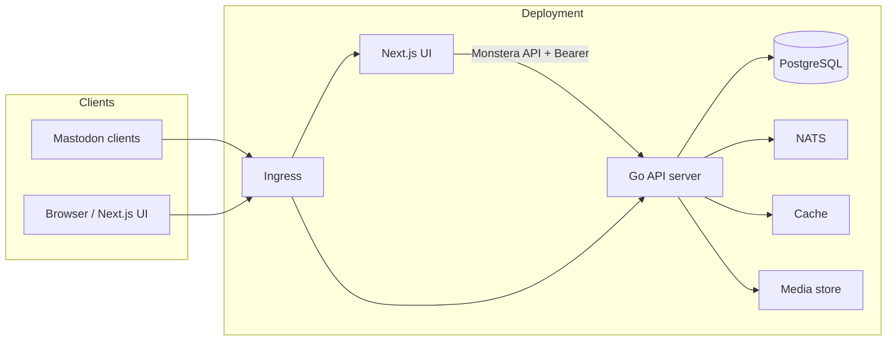

# High-level system architecture

This document describes the main components of Monstera and how they fit together.

## Overview

Monstera is an ActivityPub server that exposes a Mastodon-compatible REST API. External Mastodon clients connect to the API; the admin and moderator experience is provided by a separate Next.js application that consumes the Monstera REST API. The Go server is stateless; all durable state lives in PostgreSQL, and real-time fan-out uses NATS.

## Component diagram

## Components

| Component | Description |
|-----------|-------------|
| **Go API server** | Single binary from `cmd/server/`. Chi router; handlers for Mastodon API (`/api/v1`, `/api/v2`), ActivityPub (WebFinger, NodeInfo, actor, inbox, outbox, collections), OAuth, and Monstera admin/moderator API (`/monstera/api/v1`). |
| **Next.js UI** | Application in `ui/`. Serves the admin and moderator portal. Authenticates via OAuth (or login flow) and calls the Go backend with Bearer tokens. |
| **PostgreSQL** | Primary data store. Schema and migrations in `internal/store/migrations/`; access via `internal/store` and sqlc-generated code in `internal/store/postgres/generated/`. |
| **NATS** | Message broker. **JetStream**: durable federation delivery queue (activities to remote inboxes). **Core pub/sub**: ephemeral fan-out for SSE (no persistence). See [02-sse.md](02-sse.md) and [03-activitypub-implementation.md](03-activitypub-implementation.md). |
| **Cache** | In-memory (ristretto) by default. Used for token lookup, timeline caching, idempotency, HTTP signature replay prevention. |
| **Media store** | Pluggable: local filesystem or S3-compatible. Interface in `internal/media/store.go`; implementations in `internal/media/local` and `internal/media/s3`. |

## Request flow

- **Mastodon clients**: HTTPS → Ingress → Go API. Auth via `Authorization: Bearer <token>` (OAuth access token). Routes are grouped by OptionalAuth vs RequireAuth; scopes enforced with `middleware.RequiredScopes`.
- **Next.js UI**: Same Ingress (or separate host). Uses `authFetch` with stored access token; 401 triggers token refresh then retry. All admin/moderator calls go to `/monstera/api/v1/*` with `RequireAuth` and `RequireModerator` or `RequireAdmin`.
- **ActivityPub (federation)**: Remote servers POST to `/inbox` or `/users/{username}/inbox`. HTTP Signature verification; no Bearer auth. Inbox processing is synchronous; outbound delivery is via NATS JetStream workers.

## Federation and SSE

- **Federation delivery**: When a local user posts or follows, the server enqueues activities to NATS JetStream. A federation worker (see `internal/activitypub/outbox_fanout_worker.go`) consumes jobs and POSTs to remote inboxes with retries. See [03-activitypub-implementation.md](03-activitypub-implementation.md).
- **SSE**: The Mastodon streaming API is implemented with a per-process Hub (`internal/events/sse/hub.go`) that subscribes to NATS core pub/sub. Events (update, notification, delete) are published to NATS by the service layer; the Hub fans them out to connected SSE clients. See [02-sse.md](02-sse.md).
