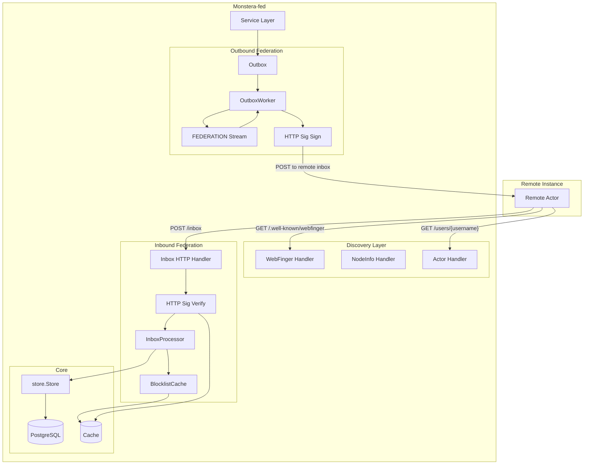

# ActivityPub and federation

This document describes the desired ActivityPub inbox/outbox, HTTP Signatures, federation worker, and supported activity types. Build order is in [roadmap.md](../roadmap.md).

---

## Design decisions

| Question | Decision |
|----------|----------|
| Polymorphic `object` field | **`json.RawMessage`** with typed accessor methods — avoids custom `UnmarshalJSON` complexity; callers decode on demand |
| `@context` value | **Array literal** — `["https://www.w3.org/ns/activitystreams", "https://w3id.org/security/v1", mastodonExtensions]` |
| Mastodon extensions in context | Phase 1: `sensitive`, `manuallyApprovesFollowers`, `Hashtag`, `toot:Emoji`. Deferred: `movedTo` (Phase 2 account migration), `featured`, `featuredTags` |
| `to`/`cc` addressing | `[]string` with constant `PublicAddress = "https://www.w3.org/ns/activitystreams#Public"` |
| Content negotiation on `GET /users/:username` | **AP JSON for all requests** — Monstera-fed has no HTML profile (users bring their own client). `Content-Type: application/activity+json` always. |
| Inbox processing mode | **Synchronous** on the HTTP handler goroutine for Phase 1. Async goroutine pool is a Phase 2 enhancement. |
| Remote media on `Create{Note}` | **Store `remote_url` only** — no fetch in Phase 1. Lazy-fetch on first access is Phase 2. |
| Idempotency | `INSERT … ON CONFLICT (ap_id) DO NOTHING` — duplicate activities silently ignored |
| `Undo{Like}` activity ID tracking | **`ap_id` column on `favourites`** — consistent with `follows.ap_id` and `statuses.ap_id`; enables exact match on incoming `Undo{Like}` by activity ID, not just `(actor, object)` heuristic |
| `Undo{Announce}` tracking | Boosts are stored as statuses with `ap_id` — already covered |
| Shared inbox delivery | **Deduplicate by inbox URL** — one delivery per unique shared inbox, not per follower |
| `featured` collection | **Empty stub** in Phase 1 — prevents 404 from remote instances fetching pinned posts |
| Federation worker consumer type | **Pull consumer** — backpressure-friendly; configurable concurrency |
| NATS delivery subject | `federation.deliver.{activityType}` — e.g. `federation.deliver.create`, `federation.deliver.follow` |

---

## Architecture overview

---

## `internal/activitypub/blocklist.go` — Domain Block Cache

The blocklist is checked on every inbound activity and before every outbound delivery. It must be fast (no DB round-trip per request) and consistent across replicas.

---

## `internal/activitypub/outbox.go` — Outbox

The Outbox is called by the service layer when a local user performs an action that must be federated. It builds the AP activity JSON, determines the delivery targets, and sends delivery messages via the OutboxWorker’s `Process` method. The OutboxWorker publishes to the FEDERATION stream and (in a separate loop) consumes from it to POST to remote inboxes.

---

## `internal/api/activitypub/` — AP HTTP Handlers

All handlers live under `internal/api/activitypub/`. Each file exports a handler struct constructed via dependency injection. Handlers never reference the NATS client or OutboxWorker directly — they work through the `Inbox` and `Outbox` types.

### Handler Summary Table

| File | Endpoint | Content-Type | Cache | Auth |
|------|----------|-------------|-------|------|
| `webfinger.go` | `GET /.well-known/webfinger` | `application/jrd+json` | `max-age=3600` | None |
| `nodeinfo.go` | `GET /.well-known/nodeinfo` | `application/json` | `max-age=1800` | None |
| `nodeinfo.go` | `GET /nodeinfo/2.0` | `application/json` | `max-age=1800` | None |
| `actor.go` | `GET /users/{username}` | `application/activity+json` | `max-age=180` | None |
| `outbox.go` | `GET /users/{username}/outbox` | `application/activity+json` | None | None |
| `collections.go` | `GET /users/{username}/followers` | `application/activity+json` | `max-age=180` | None |
| `collections.go` | `GET /users/{username}/following` | `application/activity+json` | `max-age=180` | None |
| `collections.go` | `GET /users/{username}/collections/featured` | `application/activity+json` | `max-age=180` | None |
| `inbox.go` | `POST /users/{username}/inbox` | N/A (accepts `activity+json`) | None | HTTP Signature |
| `inbox.go` | `POST /inbox` | N/A (accepts `activity+json`) | None | HTTP Signature |

---
